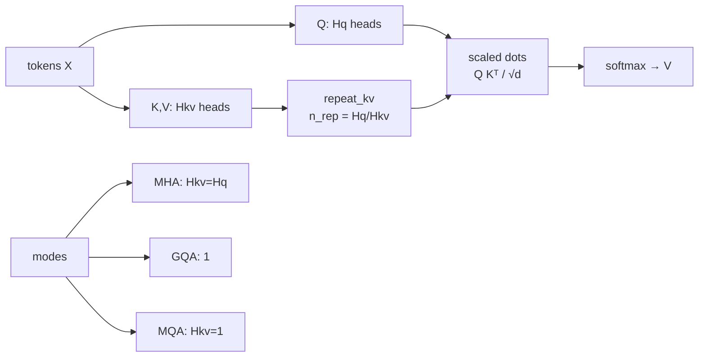

# ai-learn-28-grouped-query-attention

**Grouped Query Attention (GQA)** and **Multi-Query Attention (MQA)** from scratch in NumPy — share K/V across query-head groups (Ainslie et al. 2023 / Llama-2 style), compare MHA vs GQA vs MQA on KV-cache bytes and attention fidelity.

Part of the AI learning series (after `ai-learn-27-alibi-attention`; RoPE was `ai-learn-26`).

## Architecture



## What you'll learn
- How **GQA** lets `n_kv_heads` divide `n_q_heads` so each KV head is shared by a group of query heads (repeat/interleave along the head axis).
- That **MQA** is the extreme case `n_kv_heads == 1` — maximum KV-cache savings, more capacity loss.
- Why decode-time **KV cache** scales with `n_kv_heads`, not `n_q_heads` — GQA with Hq=8, Hkv=2 is **4×** smaller than MHA; MQA is **8×**.
- How collapsed-KV cosine fidelity vs full MHA stays higher for GQA than MQA (milder sharing).
- On a planted-key matching task, GQA can approach MHA accuracy while MQA may lag slightly — capacity vs memory tradeoff.

## Layout
| file | purpose |
|---|---|
| `gqa.py` | `repeat_kv`, KV-byte formulas, mode helpers |
| `attention.py` | Tiny GQAAttention with configurable `n_q_heads` / `n_kv_heads` |
| `experiments.py` | KV savings table, fidelity vs MHA, matching batch helpers |
| `train_task.py` | Q/K train loop for planted-key matching (MHA/GQA/MQA) |
| `run_smoke.py` | Deterministic smoke (seed 42) → `results/` |
| `smoke_plots.py` | SVG plots + RESULTS.md writer |
| `svg_utils.py` | Minify matplotlib SVGs for clean diffs |
| `notebooks/grouped_query_attention.ipynb` | Step-by-step walkthrough |
| `results/` | `RESULTS.md`, `metrics.json`, `JSON.shot`, SVG plots |

## Run
```bash
pip install -r requirements.txt
python run_smoke.py          # ~1–3 s on CPU, seed 42, writes results/
jupyter notebook notebooks/grouped_query_attention.ipynb
```

## Results (seed 42, from `results/metrics.json`)
| check | MHA | GQA (Hkv=2) | MQA |
|---|---|---|---|
| KV reduction vs MHA | 1× | **4×** | **8×** |
| cosine fidelity (collapsed KV) | 1.0 | **0.446464** | 0.385785 |
| matching top-1 acc | **1.0** | 0.98125 | 0.95 |
| wall time | — | — | **~1.14 s** CPU |

Expand round-trip (`repeat_kv`) sanity: pass=True. See [results/RESULTS.md](results/RESULTS.md) for full tables and plots.

## Caveats
- Toy multi-head attention and a synthetic matching task — not a full Transformer / LM.
- Fidelity uses *collapsed* MHA K/V (mean within groups) so GQA/MQA start from a fair shared projection; random independent KV is also reported.
- Softmax uses an educational `logit_scale` so peaks are visible; ranking metrics use the same scores.
- Real GQA training often upcycles from MHA checkpoints (Ainslie et al.); we only simulate collapse + short NumPy training.

## Next steps
- Causal GQA decoder on the mini-transformer from `ai-learn-04` with a real KV cache (`ai-learn-15`).
- Combine GQA + RoPE (`ai-learn-26`) or ALiBi (`ai-learn-27`).
- Measure decode latency proxy (cache bytes × steps) vs quality on a tiny LM.
