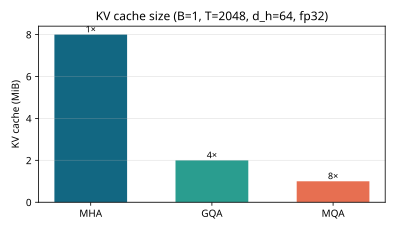
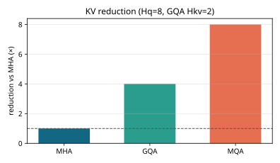
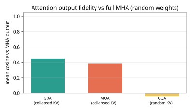
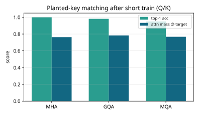
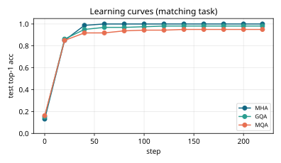
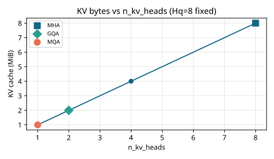

# Results: ai-learn-28-grouped-query-attention

Real output of `python run_smoke.py` (seed 42, CPU, 1.14 s wall time).

## Setup
- d_model=64, n_q_heads=8, n_kv_gqa=2, seq_len(train)=16.
- KV-cache table: B=1, T=2048, d_head=64, dtype=float32.
- Matching task: 2 content-matched distractors; train Q/K for 220 steps, logit_scale=12.0.

## KV cache (structural)
| mode | n_kv_heads | n_rep | bytes | MiB | vs MHA |
|---|---|---|---|---|---|
| MHA | 8 | 1 | 8388608 | 8.0 | 1.0× |
| GQA | 2 | 4 | 2097152 | 2.0 | 4.0× |
| MQA | 1 | 8 | 1048576 | 1.0 | 8.0× |

## Output fidelity vs MHA (random weights, collapsed KV)
- GQA cosine: **0.446464**
- MQA cosine: **0.385785**
- GQA (random KV, shared Q/O): -0.04066
- GQA closer than MQA: True

## Planted-key matching (after train)
| mode | n_kv | top-1 acc | attn mass @ target |
|---|---|---|---|
| MHA | 8 | 1.0 | 0.762712 |
| GQA | 2 | 0.98125 | 0.783248 |
| MQA | 1 | 0.95 | 0.767197 |

## Headline
- KV reduction: GQA **4.0×**, MQA **8.0×** vs MHA.
- Cosine fidelity (collapsed): GQA **0.446464** > MQA **0.385785**.
- Matching acc: MHA **1.0**, GQA **0.98125**, MQA **0.95**.
- Expand round-trip check: pass=True.

## Plots
- 
- 
- 
- 
- 
- 

## Notes
- GQA repeats each KV head `n_rep = Hq / Hkv` times before QKᵀ (Llama-2 style).
- Collapsed-KV fidelity averages MHA's per-head K/V within groups — milder for GQA than MQA.
- Toy NumPy attention + synthetic matching task, not a full Transformer / LM.
